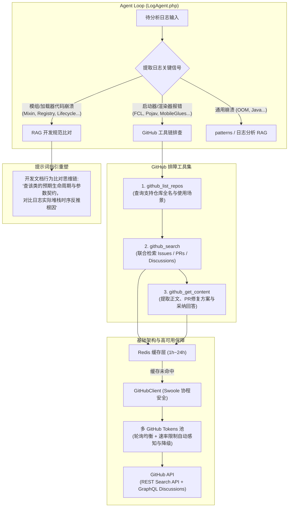
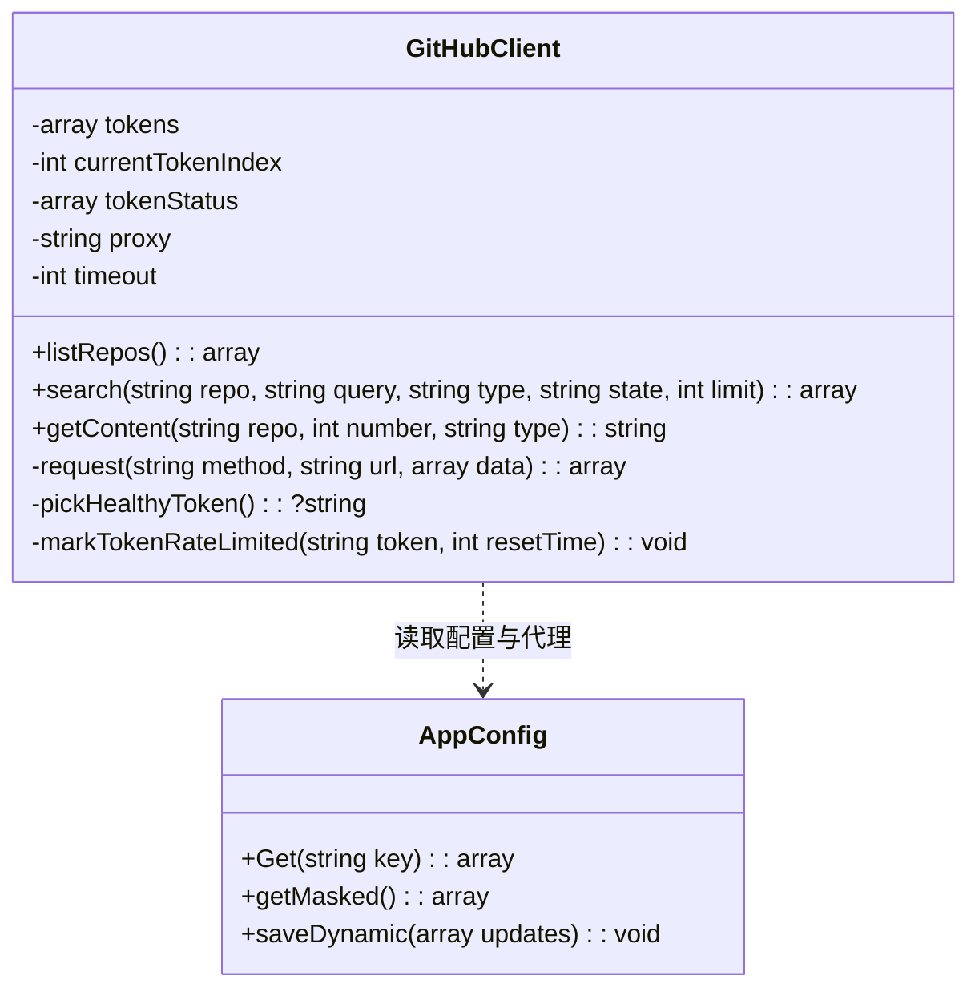

# LogShare Agent Loop 集成 GitHub 排障工具与知识库精简改造方案

## 一、背景与设计目标

### 1.1 背景痛点
- **实战知识库时效性不足**：当前 RAG 知识库中内置了大量移动端启动器（FCL、ZL2、Amethyst、PGW 等）与渲染器（MobileGlues 等）的手工蒸馏 Issue 案例。启动器与渲染器迭代频繁，静态 Markdown 极易过时甚至产生误导。
- **ModLoader 规范与深度诊断未充分发挥**：知识库中沉淀的大量 Fabric、Forge、NeoForge、Quilt 等加载器官方开发文档，此前仅作为泛化检索源，未在提示词中明确建立「利用加载器 API/生命周期预期规范反推崩溃类行为」的深度推理链。
- **API 速率与额度瓶颈**：GitHub Search API 存在严格速率限制（未认证仅 10 次/分，单个 Token 为 30 次/分），且 Discussions 检索必须依赖 GraphQL API，需要一套高可用、多 Token 轮换与缓存健全的工程化方案。

### 1.2 核心目标
1. **上线 GitHub 排障三件套工具**：在 Agent Loop 中新增 `github_list_repos`、`github_search`（支持 Issues、PRs、Discussions 联合检索）与 `github_get_content`，实现动态、实时的社区证据闭环。
2. **支持多 GitHub Tokens 池化与故障切换**：支持配置多个 GitHub Personal Access Tokens（PAT），支持轮询均衡、速率感知与自动 Failover，成倍提高并发额度。
3. **全面接入 Admin 与动态配置**：配置项支持 `.env`、`Config.inc.php` 以及 Admin API（`/config`），支持在线修改、Token 自动脱敏掩码、反向安全恢复与毫秒级热加载。
4. **重塑提示词体系**：
   - 启动器与渲染器问题全面导向 GitHub 官方仓库检索；
   - 引导模型运用知识库中丰富的 Mod 加载器开发文档，基于异常类/接口定义与生命周期契约，推理日志中错误类的行为根因；
   - 强调各启动器使用官方全名规范。
5. **知识库精简与瘦身**：明确保留手机启动器常识（`mobile_launcher`）、通用崩溃模式（`patterns`）、报错条目（`日志分析`）及各加载器官方文档；安全移除过时的启动器/渲染器实战目录，重建精简索引。

---

## 二、架构全景与执行流程



---

## 三、Agent Loop 扩展工具（Tools）详细设计

### 3.1 `github_list_repos`（仓库目录与场景发现工具）
- **功能描述**：列出当前系统官方支持并推荐查询的 Minecraft 启动器与渲染器仓库全貌。模型在不确定仓库全名或检索范围时优先调用此工具。
- **参数**：无入参（`{}`）。
- **执行特性**：纯本地内存映射读取，**0 网络消耗，0 GitHub 配额损耗**。
- **返回数据结构示例**：
  ```markdown
  官方推荐排障仓库列表：
  - FoldCraftLauncher (别名: fcl) -> FCL-Team/FoldCraftLauncher
    适用场景: Android 平台移动端启动器，涵盖 Java 运行时安装、触控布局、模组配置等问题。
  - PojavLauncher (别名: pojav) -> PojavLauncherTeam/PojavLauncher
    适用场景: 全球主流 Android/iOS 移动端启动器，包含 libglfw、OpenAL、Java 堆栈崩溃。
  - Amethyst-Launcher (别名: amc, amethyst) -> Amethyst-Launcher/Amethyst
    适用场景: PojavLauncher 官方续作，针对新 Android 版本环境与权限适配。
  - PojavLauncher-Glow-Worm (别名: pgw) -> Glow-Worm-Project/PojavLauncher-Glow-Worm
    适用场景: 移动端 Pojav 分支，主打扩展渲染器与优化补丁支持。
  - MobileGlues (别名: mg, mobileglues) -> sparrow-app/MobileGlues
    适用场景: 移动端 OpenGL/Vulkan 渲染桥接中间件，专门处理图形崩溃、着色器兼容与光影报错。
  - Hello Minecraft! Launcher (别名: hmcl) -> HMCL-dev/HMCL
    适用场景: 跨平台主流桌面启动器，涵盖 Fabric/Forge 安装器故障、Java 下载与账号授权。
  ```

### 3.2 `github_search`（Issue / PR / Discussion 联合检索工具）
- **功能描述**：在指定仓库中按关键词检索 Issues、Pull Requests 与 Discussions。
- **参数规格**：
  - `repo` (`string`, 必填)：启动器全名、别名（如 `fcl`、`pojav`）或完整 `owner/repo`。
  - `query` (`string`, 必填)：检索关键词（如异常类名 `VkSurfaceKHR`、错误特征 `SIGSEGV`、中文症状 `闪退`）。
  - `type` (`string`, 可选，默认 `all`)：支持 `all`、`issue`、`pr`、`discussion`。
  - `state` (`string`, 可选，默认 `all`)：支持 `all`、`closed`（解决类通常为 closed）、`open`。
  - `max_results` (`integer`, 可选，默认 5，上限 10)。
- **PR（Pull Request）检索核心价值**：
  - 许多启动器与渲染器的疑难 Bug 并未在单独 Issue 中完全解答，而是在 PR 中直接描述：“Fix crash on Android 14 caused by...”、“Resolve #1234 by updating gl4es”。PR 包含确切的代码修复原理，是强有力的排障证据。
- **返回数据格式**：
  ```markdown
  在 FCL-Team/FoldCraftLauncher 中检索 "SIGSEGV" 结果：
  1. [PR #852 (Merged)] 修复 Android 14 下渲染库加载崩溃
     - 状态: 已合并 | 标签: bugfix, renderer | 更新: 2026-04-12
     - 匹配摘要: 针对部分设备在调用 dlopen 加载 libgl4es.so 时发生的 SIGSEGV 进行了修复，更新了内存对齐逻辑...
  2. [Discussion #621 (Answered)] 1.20.4 进入世界闪退且报 SIGSEGV
     - 状态: 已采纳官方回答 | 更新: 2026-03-15
     - 采纳答案摘要: 将启动器内渲染器设置从 VirGL 切换至 MobileGlues 2.1，并关闭渲染优化即可解决...
  3. [Issue #730 (Closed)] 启用光影后崩溃
     - 状态: 已关闭 | 标签: crash | 更新: 2026-02-18
  ```

### 3.3 `github_get_content`（详情与精准解答抓取工具）
- **功能描述**：拉取指定 Issue、PR 或 Discussion 的完整描述及高质量回复。
- **参数规格**：
  - `repo` (`string`, 必填)：启动器全名、别名或 `owner/repo`。
  - `number` (`integer`, 必填)：编号。
  - `type` (`string`, 可选，默认 `auto`)：`issue`、`pr`、`discussion` 或 `auto`（根据编号自动识别）。
- **抗噪与上下文精炼算法（防止 Token 膨胀）**：
  1. **楼主首帖正文（OP Body）**：保留环境参数（设备型号、安卓版本、MC版本、加载器版本）、崩溃日志片段与复现步骤。
  2. **PR 特有信息**：提取 PR 解决说明（Resolves / Closes #xxx）、代码变更核心意图、合并状态。
  3. **评论提取过滤策略**：
     - **最高优先级**：标记为 `isAnswer` 的讨论采纳方案；
     - **高优先级**：具备官方维护者徽标（`OWNER`、`MEMBER`、`COLLABORATOR`）的回复；
     - **次优先级**：点赞数（Reactions 统计）最高的社区有效解决方案；
     - **黑名单过滤**：自动剔除无实质技术内容的垃圾评论（如纯表情、"+1"、"me too"、"蹲一个"、"同问"）；
  4. **严格截断预算**：结果总文本上限控制在 `12KB`，超限整行截断并保留首尾，符合 `LogAgent::MAX_TOOL_RESULT_BYTES`。

---

## 四、多 GitHub Tokens 池化与高可用架构



### 4.1 多 Token 轮询与故障转移（Failover）设计
GitHub 对 API 调用的限流以 Token 为独立计量实体：
- **Token 轮询算法**：内存中维护轮询计数器 `$currentTokenIndex`，请求时轮流派发不同 Token，使 Search API 额度线性倍增（$30 \times N$ 次/分钟）。
- **速率限制感知（Rate-Limit Tracking）**：
  - 每次收到 GitHub 响应，读取 HTTP 标头 `X-RateLimit-Remaining` 与 `X-RateLimit-Reset`；
  - 当检测到某个 Token 的 `Remaining == 0`，或收到 `403 rate limit exceeded` / `429 Too Many Requests` 时：
    1. 将该 Token 标记为 `cooling_down` 状态，并记录其恢复时间戳（`resetTime`）；
    2. 立即将当前请求透明切换（Failover）至下一个健康的 Token 重试，外部 Agent 调用无感；
    3. 在冷却倒计时结束前，跳过该 Token 的轮询分发。
- **无 Token 降级（Graceful Degradation）**：
  - 若所有 Token 均处于冷却或未配置 Token：REST Issues 检索降级为未认证请求（带 IP 速率警告），Discussions 检索因 GraphQL 鉴权限制跳过并给出明确指引。

---

## 五、配置体系与 Admin 治理集成

### 5.1 配置文件规划 (`Config.inc.example.php` / `Config.inc.php`)
```php
    /* ─── GitHub 启动器/渲染器实战检索配置 ───────────────────────── */
    'github' => [
        // 工具总开关：启用后向 Agent Loop 注入 github_* 工具集
        'enabled' => false,

        // GitHub 访问令牌池（支持多 Token 轮询与故障切换）
        // 可配置单个字符串或 Token 数组，如 ['ghp_token1', 'ghp_token2']
        // 未认证走匿名模式（受 IP 严格限流，不支持 Discussions）
        'tokens' => [],

        // 可选 HTTP/SOCKS5 代理（如 'http://127.0.0.1:7890'）
        'proxy' => '',

        // 请求超时时间（秒，建议 8~10 秒）
        'timeout' => 8,

        // Redis 缓存时长（秒，默认 3600）
        'cache_ttl' => 3600,

        // 检索返回结果上限（默认 5）
        'max_results' => 5,

        // 官方推荐启动器与渲染器仓库全名映射清单
        'repos' => [
            'fcl' => [
                'name' => 'FoldCraftLauncher',
                'repo' => 'FCL-Team/FoldCraftLauncher',
                'aliases' => ['fcl', 'foldcraft'],
                'desc' => 'Android 平台移动端启动器，涵盖 Java 运行时安装、触控布局、模组配置等问题',
            ],
            'pojav' => [
                'name' => 'PojavLauncher',
                'repo' => 'PojavLauncherTeam/PojavLauncher',
                'aliases' => ['pojav', 'pojavlauncher'],
                'desc' => '全球主流移动端启动器，包含 libglfw、OpenAL、Java 堆栈与安卓各版本兼容问题',
            ],
            'amethyst' => [
                'name' => 'Amethyst-Launcher',
                'repo' => 'Amethyst-Launcher/Amethyst',
                'aliases' => ['amc', 'amethyst'],
                'desc' => 'PojavLauncher 官方续作，针对新 Android 版本权限、运行时与环境适配',
            ],
            'pgw' => [
                'name' => 'PojavLauncher-Glow-Worm',
                'repo' => 'Glow-Worm-Project/PojavLauncher-Glow-Worm',
                'aliases' => ['pgw', 'glowworm'],
                'desc' => '移动端 Pojav 增强分支，主打扩展渲染器支持与运行优化',
            ],
            'mobileglues' => [
                'name' => 'MobileGlues',
                'repo' => 'sparrow-app/MobileGlues',
                'aliases' => ['mg', 'mobileglues'],
                'desc' => '移动端渲染桥接组件，专门处理图形崩溃、着色器报错与光影兼容性问题',
            ],
            'hmcl' => [
                'name' => 'Hello Minecraft! Launcher',
                'repo' => 'HMCL-dev/HMCL',
                'aliases' => ['hmcl'],
                'desc' => '主流跨平台桌面启动器，涵盖 Fabric/Forge 安装器故障、Java 下载与账号授权',
            ],
        ],
    ],
```

### 5.2 环境变量支持 (`.env`)
在 `App\Config::applyEnvironmentOverrides()` 中适配：
- `GITHUB_ENABLED`：`true`/`false` 覆盖 `github.enabled`
- `GITHUB_TOKENS` / `GITHUB_TOKEN`：逗号分隔的 Token 列表（如 `ghp_a,ghp_b`），自动拆分解析为数组覆盖 `github.tokens`
- `GITHUB_PROXY`：覆盖 `github.proxy`
- `GITHUB_CACHE_TTL`：覆盖 `github.cache_ttl`

### 5.3 Admin 控制台脱敏与热更新保障
1. **脱敏呈现 (`Config::getMasked()`)**：
   - 遍历 `github.tokens` 中的每个 Token，使用 `Config::maskSecret()` 转换为 `ghp_****a1b2` 或 `********` 格式；
   - 对外绝不暴露真实凭据明文。
2. **安全恢复 (`Config::restoreMaskedSecrets()`)**：
   - 当管理员在 Admin WebUI 保存配置时，智能比对每个 Token：若包含 `****`，自动保留原始 Token 值；若传入新的真实 Token，则更新入库。
3. **秒级热重载与审计**：
   - 保存至 `runtime/dynamic_config.json`；
   - 基于文件 `mtime` 的 `Config::ensureFresh()` 机制，常驻 Swoole Worker 在下一请求立即生效，无需重启进程；
   - 写入 `AuditLogManager::record('config.update', 'github', ...)` 进行审计留痕。

---

## 六、Swoole 驻留网络通信与 Redis 缓存

### 6.1 常驻进程网络规约
在 `app/Client/GitHubClient.php` 中严格落实：
1. **套接字即时回收**：设置 `CURLOPT_FORBID_REUSE => true`，并在 `finally` 块中执行 `$ch = null`，杜绝长连接句柄累积导致 `Too many open files`。
2. **规范 Header 与超时**：
   - `User-Agent: LogShare-Agent/1.0 (+https://github.com/NingZeStudio/LogShare)`
   - 连接超时 3 秒，总读取超时 8 秒。
3. **代理适配**：若配置了 `proxy`，自动配置 `CURLOPT_PROXY`。

### 6.2 Redis 两级防限流缓存
- **搜索结果缓存**：
  - Key: `github:search:{repo_md5}:{type}:{query_md5}`
  - TTL: 3600 秒（1小时）。相同报错短期内直接返回，时延由 1.2s 骤降至 1ms。
- **条目详情缓存**：
  - Key: `github:detail:{repo_md5}:{type}:{number}`
  - TTL: 对已 Closed / Merged 的条目缓存 24 小时；对 Open 条目缓存 1 小时。

---

## 七、全新提示词（Prompt）体系与思维链演进

### 7.1 系统提示词重塑要点
在 `app/Agent/LogAgent.php` 的 `defaultSystemPrompt()` 及检索策略指引中进行核心改造：

1. **启动器与渲染器排障全面转向 GitHub 社区证据**：
   - 知识库不再保留启动器 Issue 蒸馏库（避免过时信息误导）；
   - 当日志中出现启动器名称（如 FoldCraftLauncher、PojavLauncher 等）或渲染器（如 MobileGlues、gl4es 等）报错时：
     1. 首先可调用 `github_list_repos` 获取各启动器的**官方全名**与支持仓库；
     2. 使用启动器全称或别名调用 `github_search` 进行定向检索（注意同时利用 PR 了解最新修复补丁）；
     3. 结合 `github_get_content` 获取 1 个最具吻合度的条目与维护者答复作为核心结论依据。
2. **知识库定位转向：ModLoader 官方开发规范与行为比对**：
   - **明确声明**：知识库内置资产绝大多数为各加载器（Fabric, Forge, NeoForge, Quilt 等）以及服务端的**官方开发规范文档**；
   - **核心思维链注入**：
     > “当日志堆栈抛出未捕获异常、类未找到、方法不存在（`NoSuchMethodError`）、Mixin 注入失败或注册表报错时：
     > - **不要盲猜**，优先利用 `rag_search` 检索报错类、接口、注解或事件在对应 ModLoader 开发文档中的标准定义；
     > - **分析预期行为**：了解该 API 预期的生命周期阶段、参数契约、以及官方推荐写法；
     > - **对比实际调用**：将开发文档中的官方预期行为与日志中崩溃发生时的实际调用栈、时序进行比对，进而精准定位模组违规调用或破坏契约的深层原因。”
3. **手机启动器常识文档明确声明**：
   - 声明内置的 `mobile_launcher` 为手机启动器版本与渲染器兼容性常识，可用于辅助判定 Minecraft 版本与渲染器选型是否冲突。
4. **严格的防死循环调用预算**：
   - 在 `ToolSession` 中增加 `$githubSearchCalls` 计数；
   - 限制每次分析中 GitHub 检索工具调用不超过 2 次，详情读取不超过 2 次；
   - 检索有收获立即收敛输出；未检索到结果时，适可而止输出客观事实，禁止无休止更换关键词。

---

## 八、知识库精简与落地清理实施细则

### 8.1 目录清理清单（在 GitHub 工具验证完毕后执行）
| 待删除知识库目录 | 目录原始说明 | 替代手段 |
| :--- | :--- | :--- |
| `rag/knowledge/fcl-issues/` | FCL 启动器实战案例 | `github_search(repo: "FoldCraftLauncher", ...)` |
| `rag/knowledge/fcl/` | FCL 官方文档与问题集 | GitHub 检索 / 在线 Wiki |
| `rag/knowledge/zl2-issues/` | ZL2 启动器实战案例库 | 对应开源仓库 GitHub 检索 |
| `rag/knowledge/zl_help/` | Zalith 启动器用户帮助 | 常见使用常识直接解答 |
| `rag/knowledge/zl_control2_help/` | Zalith 布局编辑器帮助 | 非崩溃诊断内容，予以移除 |
| `rag/knowledge/zl_projects/` | Zalith 项目介绍页 | 诊断价值低，予以移除 |
| `rag/knowledge/amc-issues/` | Amethyst 启动器实战案例 | `github_search(repo: "Amethyst-Launcher", ...)` |
| `rag/knowledge/pgw-issues/` | PGW 实战案例蒸馏 | `github_search(repo: "PojavLauncher-Glow-Worm", ...)` |
| `rag/knowledge/launchers/` | PGW 启动器专题文档 | 对应 GitHub 检索替代 |
| `rag/knowledge/mg-issues/` | MobileGlues 实战案例 | `github_search(repo: "MobileGlues", ...)` |
| `rag/knowledge/mobileglues/` | MobileGlues 兼容矩阵 | GitHub 仓库最新 Release / Issues |
| `rag/knowledge/renderers/` | 渲染器家族专题文档 | GitHub Issues / 通用模式 |

> [!IMPORTANT]
> **以下目录严格保留，禁止删除**：
> 1. `rag/knowledge/mobile_launcher/`（**用户明确指定保留**：手机启动器常识与版本渲染器选型关系）；
> 2. `rag/knowledge/日志分析/`（核心通用 KB 故障库）；
> 3. `rag/knowledge/patterns/`（通用崩溃与 Mixin 故障模式库）；
> 4. `rag/knowledge/format/`（三大日志格式解析指南）；
> 5. `rag/knowledge/tools/`（测试报告样例素材）；
> 6. 全部 ModLoader 与服务端开发文档：`fabric_develop/`、`forge/`、`neoforge/`、`quilt/`、`papermc/`、`purpur/`、`geyser/`、`glowstone/`。

### 8.2 关联代码维护与单测保障
1. **`app/Rag/RagSearch.php`**：
   - 必须从常量 `TOPIC_DESCRIPTIONS` 中删除被移除的 12 个目录键值；
   - 必须保留 `'mobile_launcher' => '手机启动器常识：渲染器选择与 Minecraft 版本对应关系'`。
2. **`tests/Unit/RagSearchTest.php`**：
   - 检查并适配单测中的 mock 假数据，确保 `topic descriptions cover all knowledge directories` 双向断言 100% 绿色通过。
3. **RAG 索引原子化重建**：
   - 执行 `php bin/hyperf.php rag:build`，原子化重构生成更紧凑、纯净的 `rag/index.db`。

---

## 九、实施清单与检验规约

### 9.1 修改与新增文件清单
- **新建**：
  - `app/Client/GitHubClient.php`（GitHub 客户端：多 Token 轮换、故障转移、REST/GraphQL、缓存整合）
  - `tests/Unit/GitHubClientTest.php`（客户端与 Token 轮换单测）
- **修改**：
  - `Config.inc.example.php` / `Config.inc.php`（添加 `github` 配置节）
  - `app/Config.php`（环境变量解析、多 Token 掩码脱敏与安全恢复、校验）
  - `app/Agent/LogAgent.php`（工具注册、提示词重构、执行器调度、调用预算）
  - `app/Agent/ToolSession.php`（会话计数器）
  - `app/Rag/RagSearch.php`（同步调整 `TOPIC_DESCRIPTIONS`）
  - `AGENTS.md`（同步架构与工具使用指南）
- **删除**：
  - `rag/knowledge/` 下的 12 个历史启动器/渲染器过时目录。

### 9.2 检验命令集 (Termux 环境)
```bash
# 1. 运行核心与单元测试
php vendor/bin/pest tests/Unit/GitHubClientTest.php
php vendor/bin/pest tests/Unit/RagSearchTest.php
php vendor/bin/pest --group=architecture

# 2. 静态分析 (Level 5)
PHPSTAN_TURBO=0 php vendor/bin/phpstan analyse app --level=5 --memory-limit=512M

# 3. 重建精简版知识库
php bin/hyperf.php rag:build
```
